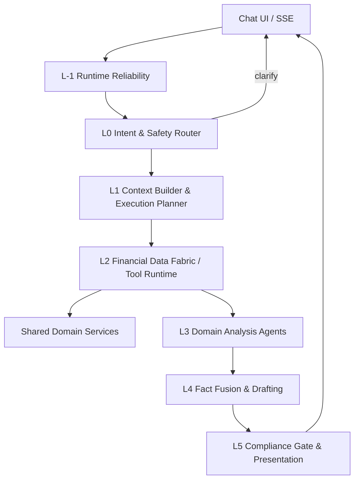
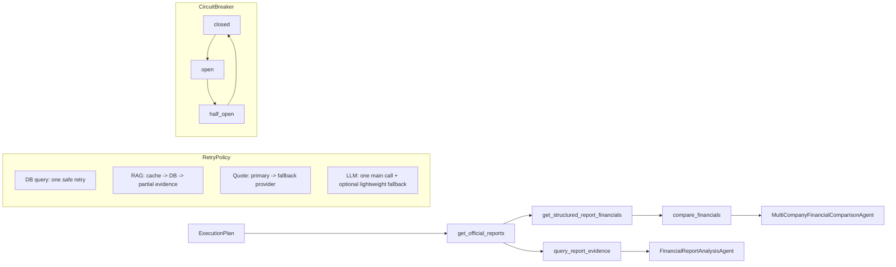
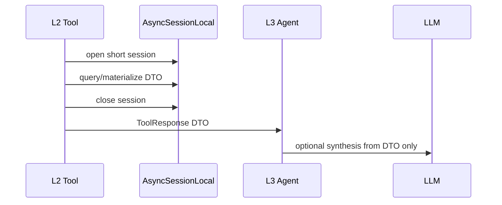

# Financial Agent Runtime Architecture

Phase 6U-E1 introduces an additive layered runtime behind `CHAT_RUNTIME_MODE=legacy|layered_v1|shadow`.

## Legacy Responsibility Map

- `chat_orchestrator`: intent routing, memory/context, skill arbitration, tool dispatch, fallback ownership.
- `Skill`: intent matching, data access, agent dispatch, answer text construction, sometimes source/disclaimer ownership.
- `Agent`: evidence retrieval, synthesis, Markdown generation, sometimes repository access.
- `Streaming`: event contract, persistence, fallback, answer guards.

This overlap caused repeated agent display, entity/report context loss, fallback contamination, duplicated disclaimers, and DB lifecycle issues.

## New Seven-Layer Runtime

## L-1 Runtime Reliability

E1 reuses the E0/E0.1 primitives instead of reimplementing them:

- `AuthPrincipal`
- `RequestDeadline`
- DB connection mode / transaction pooler policy
- Auth TTL cache and singleflight
- auth DB circuit breaker
- structured 503 contracts such as `AUTH_DATABASE_UNAVAILABLE`
- frontend retry behavior that keeps login state

The layered runtime receives verified user context from the existing Chat entrypoint. It does not read JWTs, does not query `User` ORM, and does not own message persistence.

## Tool DAG, Retry, Circuit Breaker

## DB Lifecycle

Agents, planners, SSE, and LLM calls must not hold `AsyncSession`.

## Runtime Modes

- `CHAT_RUNTIME_MODE=legacy`: production default. Layered runtime is not executed.
- `CHAT_RUNTIME_MODE=shadow`: legacy answers users; layered runtime runs read-only in the background.
- `CHAT_RUNTIME_MODE=layered_v1`: only intents listed in `CHAT_LAYERED_INTENTS` use the new runtime; unmigrated intents fall back to legacy.

Current migrated intents:

- `financial_report`
- `financial_comparison`
- `official_report_pdf`
- `financial_snapshot`
- `quote_query`

## First Migrated Scenarios

- explicit company report analysis
- multi-turn report comparison
- official PDF lookup
- company financial snapshot Q&A
- simple quote query

All other scenarios remain on legacy unless `CHAT_RUNTIME_MODE=layered_v1` is explicitly enabled and the runtime can handle the request.
