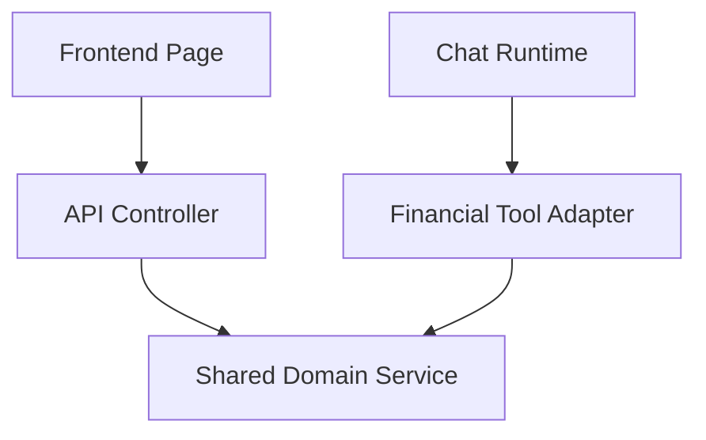

# Page Domain Service Inventory

Phase 6U-E1 requires Chat tools to reuse the same domain services and caches that power product pages. Chat tools must not call localhost HTTP endpoints.

| Page area | Endpoint/controller | Shared domain service | Repository/provider boundary | Cache/freshness | Chat capability |
|---|---|---|---|---|---|
| Company profile | `backend/app/routers/company_v2_debug.py` and Company V2 page loaders | `company_chat_data_service` -> `company_v2_history_service` / `company_v2_stock_basic_service` | BaoStock/AkShare/provider access remains inside existing Company services | Company V2 SWR cache, stock basic long TTL | `get_company_profile` |
| Quote header | stock quote endpoints and StockDetail header | `stock_data_service` | Eastmoney/Sina/Tencent provider fallback inside service | quote cache with stale fallback | `get_quote_snapshot` |
| Market overview | Stock detail quote/overview modules | `stock_data_service` | provider fallback inside service | quote/kline cache | `get_quote_snapshot`, `get_market_history` |
| Profitability | Company V2 modules | `company_chat_data_service` -> `build_company_history_dashboard` | `history_financial_provider` behind Company V2 history service | `company_history:{market}:{symbol}:{period}:v4` SWR | `get_financial_snapshot`, `get_financial_history` |
| Growth | Company V2 modules | `company_chat_data_service` -> `build_company_history_dashboard` | same as above | same as above | `get_financial_snapshot`, `get_financial_history` |
| Operation | Company V2 modules | `company_chat_data_service` -> `build_company_history_dashboard` | same as above | same as above | `get_financial_history` |
| Solvency | Company V2 modules | `company_chat_data_service` -> `build_company_history_dashboard` | same as above | same as above | `get_financial_history` |
| Cashflow | Company V2 modules | `company_chat_data_service` -> `build_company_history_dashboard` | same as above | same as above | `get_cashflow_quality` |
| DuPont | Company V2 modules | `company_chat_data_service` -> `build_company_history_dashboard` | same as above | same as above | `get_financial_history` |
| Valuation | Company V2 / quote valuation modules | `company_chat_data_service` and quote valuation fields | provider fallback remains in domain service | Company V2/quote cache | `get_valuation` |
| Report timeline | `company_v2_report_rag.py`, `company_v2_financial_fusion.py` | `official_report_domain_service` | `ReportDocument` repository behind service | persisted report list + RAG status | `get_official_reports`, `get_latest_official_report`, `get_official_report_url` |
| Structured report fields | report extraction/fusion services | `company_v2_report_evidence_service`, `report_financial_table_extractor_tool` | RAG repository remains behind service; layered runtime uses async service path | report financial fields cache where available | `get_structured_report_financials`, `query_report_evidence` |
| Industry hot | Industry hot page/controller | `industry_hot_stock_service` | provider fallback inside service | `industry_hot:{market}:{industry}:v2` SWR | `get_industry_snapshot`, `get_peer_companies` |
| News | news page/controller | existing news service stack | provider/repository behind service | news cache by symbol/query | `get_company_news`, `get_announcements`, `get_market_events` |

## Target Shape

`CompanyChatDataService` is the first shared adapter for Chat. It keeps availability separate for `quote_snapshot`, `company_profile`, `financial_snapshot`, `financial_history`, and `market_history`, so a missing market trend does not erase usable Company data.
