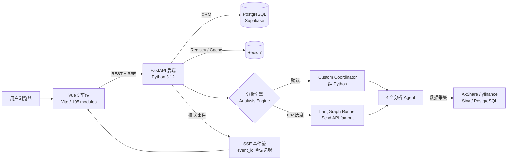
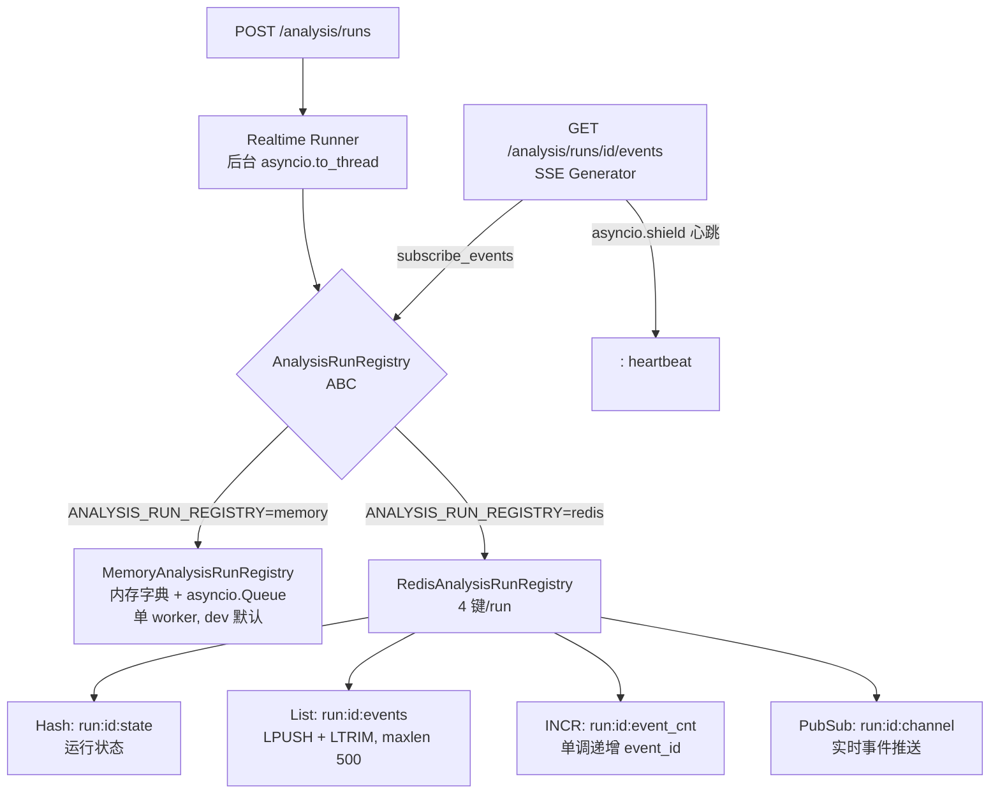
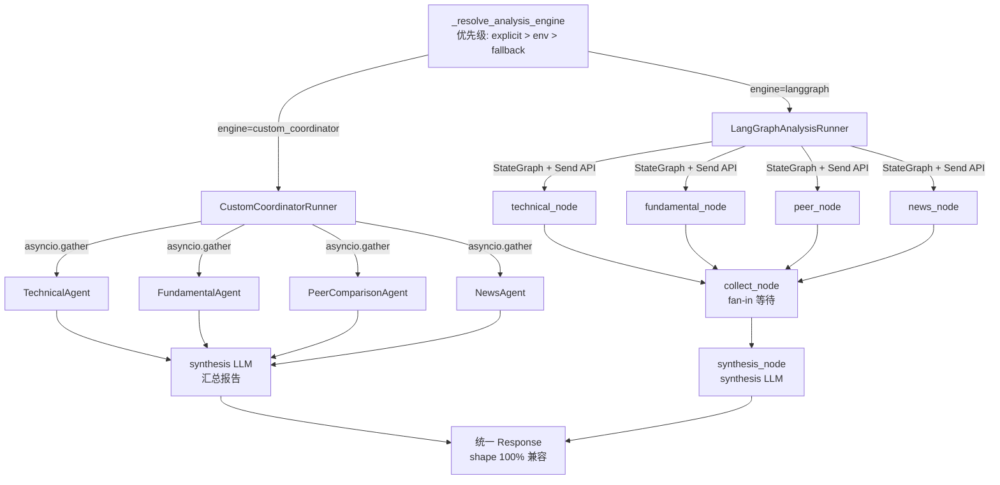

# TradingAgents — 架构概述

---

## 5.1 总体架构图



**说明：**
1. 前端通过 `fetch + ReadableStream` 订阅 SSE，不使用 `EventSource`（后者不支持 Authorization header）
2. 分析引擎由 `DEFAULT_ANALYSIS_ENGINE` env 控制默认，显式 `engine` 字段优先
3. PostgreSQL 存储用户数据、报告历史、股票主数据；Redis 存储 run 状态与事件流
4. 部署时 Nginx 在 `:80` 提供服务，反向代理 `/api/v1` 至 backend:8000

---

## 5.2 Run Registry 架构图



**说明：**
1. `MemoryAnalysisRunRegistry` 仅在单 worker 进程内有效；进程重启后 run 状态丢失
2. `RedisAnalysisRunRegistry` 4 键设计支持任意 worker 读写同一 run 状态，M43 验证 4-worker × 16 run PASS
3. SSE Generator 使用 `asyncio.shield(pending_task)` 防止心跳超时取消 async generator
4. `subscribe_events()` 三阶段：① replay `after_event_id` 后已有事件 → ② drain 队列（memory）/ LRANGE（Redis）→ ③ 实时 subscribe
5. Redis 不可用时 `_safe_get_registry()` 返回 HTTP 503，不降级到内存模式（防跨 worker 数据不一致）

---

## 5.3 Analysis Engine 架构图



**说明：**
1. 两种 engine 的 response shape 完全兼容（Python set diff 验证：top-level key 差集 = ∅）
2. `metadata.workflow_engine` 字段标明所用引擎（`"custom_coordinator"` 或 `"langgraph"`）
3. Custom coordinator 使用 `asyncio.gather`；LangGraph 使用 `StateGraph.Send` API fan-out
4. LangGraph `stream_mode="updates"` 可能 yield `{node_name: None}`（条件边 pass-through），已加 None 守卫
5. synthesis LLM 失败时使用 `_fallback_report` 生成降级报告，不中断 SSE 流

---

## 5.4 关键数据流：一次完整分析请求

```
用户点击"开始分析"
    │
    ▼
POST /api/v1/analysis/runs
  body: { market, symbol, analysis_scope, output_language, engine? }
    │
    ▼
_resolve_analysis_engine(body.engine)
  → "custom_coordinator" | "langgraph"
    │
    ▼
create run_id → store in Registry (state="running")
    │
    ├──► 返回 { run_id } 给前端（< 200ms）
    │
    ▼
asyncio.to_thread(runner.run, run_id, request)
  [后台 worker 线程]
    │
    ├── emit: analysis_started
    ├── emit: identity_resolved
    ├── emit: agent_started (×4, 并行)
    ├── [各 Agent 采集数据 + LLM 子分析]
    ├── emit: agent_completed (×4)
    ├── emit: synthesis_started
    ├── [synthesis LLM 汇总]
    ├── emit: synthesis_completed
    └── emit: report_ready { result: { sections, metadata, output_language, ... } }
    │
    ▼
GET /api/v1/analysis/runs/{run_id}/events  [前端 SSE 订阅]
  三阶段 replay → drain → live subscribe
  asyncio.shield 心跳（每 15s 发 ": heartbeat\n\n"）
    │
    ▼
前端 SSE 解析 → 更新进度条 → report_ready 后渲染报告
```

---

## 5.5 部署架构（Docker Compose）

```
外部请求 :80
    │
    ▼
Nginx (frontend container)
    ├── /* → Vue SPA 静态文件
    └── /api/v1/* → backend:8000 (内部网络)
                        │
                    FastAPI (4+ workers)
                        │
                    ┌───┴───┐
                  Redis   PostgreSQL
               (内部网络)  (Supabase 外部)
```

**关键点：**
- Redis 仅暴露在 Docker 内部网络，不对外
- PostgreSQL 使用 Supabase Transaction Pooler，不在 compose 内
- `migrate` 服务为一次性 Alembic 容器，运行后退出
- backend 仅 `expose: 8000`（内部），不 `ports`
