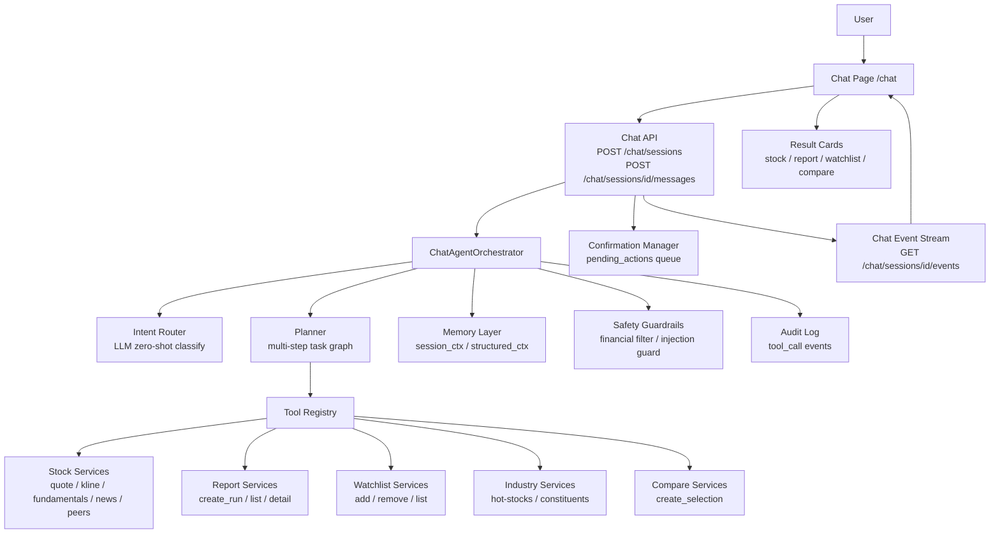

# TradingAgents — OpenClaw-inspired 金融智能 Agents 技术架构设计

> 版本：Phase C13-b 完成  
> 日期：2026-06-22  
> 状态：C4 ✅ C5 ✅ C6 ✅ C7 ✅ C8 ✅ C9 ✅ C10 ✅ C11-a ✅ C11-b ✅ C11-c ✅ C12 ✅ C13-a ✅ **C13-b ✅ Real-time Tool/RAG/Skill Event Streaming（safe_emit + ToolRegistry + RAG + 6 Skills + PlannerExecutor + Phase 5 dedup，754/754 tests PASS）**

**C11-b 新增：**
- **RAG 层（`app/agents/chat_rag/`）**：内部数据检索（新闻/报告/行业），rule-based 三审代理（Source / Freshness / Consistency），可信度三级评级（high/medium/low），4 只 Skill 全量集成
- **Internal Agent Workflow**：`analysis_and_save_report` intent（分析+保存）、`external_channel` intent（礼貌拒绝，设计文档 `docs/external_agent_channels_design.md`）
- **Chat UX 升级**：ChatSessionSidebar、超时保护（15s soft / 45s hard）、停止按钮、ChatReasoningSteps、扩展 QuickActions（4 组 × 4 题）、6 语言新增 25 键

---

## 1. 总体架构



---

## OpenClaw-inspired 架构映射

TradingAgents 以 OpenClaw 类 Agentic AI 系统思想为参照，将金融研究能力组织为分层架构。

| OpenClaw 架构组件 | TradingAgents 对应设计 | 当前状态 |
|---|---|---|
| **Chat Channel** | `/chat` ChatCopilotView — 自然语言入口，不替代工作台页面 | ✅ C2 |
| **Tool Registry** | `chat_tools/` — 9 只只读金融工具，BaseTool ABC + ToolResult | ✅ C4 |
| **Skills** | `chat_skills/` — 6 类金融研究技能（异动/风险/新闻/自选/行业/报告） | ✅ C6 |
| **Memory** | 短期（session）+ 结构化（DB）+ 任务状态（session） | C8 |
| **Planner** | 多步骤任务拆解，RuleBasedPlanner + PlannerExecutor，6 复合任务类型，最多 5 步 | ✅ C7 |
| **Action** | 确认后真实执行（加自选/生成报告/创建对比） | C5 |
| **Permissions** | `read_only / write_user_data / long_running / sensitive` 四级 | ✅ C4 定义 |
| **Confirmation** | 所有写操作和长耗时任务必须用户确认后执行 | ✅ mock / C5 持久化 |
| **Audit Trail** | tool_events 随每条 assistant 消息保存，C8 DB 持久化 | ✅ 部分实现 |
| **Safety Guardrails** | 金融合规 + 禁用投资建议 + Prompt Injection 防护 + 数据截断 | ✅ 基础实现 |

### 网站工作台与 Chat Agent 的关系

工作台页面**不被替代**，而是成为 Agent 的工具基座和结果落地层：

```
[用户自然语言输入]
        ↓
  Chat Copilot Agent
  (Orchestrator → Skills → Tools → Action)
        ↓                        ↓
  工具数据来源层              结果落地层
  (行情/K线/新闻/行业)       (报告/自选/对比/行业页)
        ↑                        ↑
  现有 Services            现有工作台页面（/history /watchlist /compare...）
```

---

## C7 Orchestrator 分发层级（当前实现）

```
process_message() 分发顺序（C7，6 层）：
  1. Safety guard          — 交易指令 / 价格预测拦截（永远最先）
  2. Action intents        — 显式写操作（生成报告 / 加入自选 / 对比）→ 确认流程
  3. Controlled Planner    — 复合多步骤研究任务（C7 新增）
     RuleBasedPlanner.is_compound() 检测 → plan() 生成 PlannerResult
     PlannerExecutor.execute() 顺序执行所有 Steps
  4. SkillRegistry         — 单步金融研究技能匹配（C6）
  5. C4 fallback intents   — 直接工具调用（行情/新闻/行业/历史报告）
  6. Default greeting      — 兜底欢迎消息
```

**C7 Planner 支持的复合任务类型（6 类）：**

| intent_type | 触发条件 | 执行步骤 |
|---|---|---|
| anomaly_then_risk | 异动信号 + 风险信号 | stock_anomaly_skill → risk_first_skill → final_summary |
| report_then_risk | 报告信号 + 风险信号 | report_explanation_skill → risk_first_skill → final_summary |
| watchlist_scan | 自选股信号 + 巡检信号 | watchlist_review_skill → final_summary |
| industry_then_stocks | 行业信号 + 个股信号 | industry_hotspot_skill → final_summary |
| research_then_action | 研究信号 + 加自选信号 | [anomaly/risk]_skill → final_summary → add_watchlist(confirm) |
| compare_then_report | 对比信号 + 报告信号 | create_compare(confirm) + clarification |

---

## C4 实际实现结构（2026-06-18）

```
backend/app/agents/
├── chat_orchestrator.py          # C7 Orchestrator — 6层分发，Planner + Skills + Tools
├── chat_mock_orchestrator.py     # C3 遗留 mock（保留供回退，不被路由器使用）
├── chat_planner/                 # C7 Controlled Planner
│   ├── __init__.py               # 包入口（PlanStep, PlannerResult, ExecutionResult, ...)
│   ├── base.py                   # PlanStep / PlannerResult / ExecutionResult dataclasses
│   ├── rule_based_planner.py     # RuleBasedPlanner（纯正则规则，无 LLM）
│   └── executor.py               # PlannerExecutor（顺序执行步骤，安全合规输出）
├── chat_skills/                  # C6 Financial Skills Layer
│   ├── base.py                   # BaseSkill ABC / SkillContext / SkillResult
│   ├── registry.py               # SkillRegistry（select_skill / select_by_name）
│   ├── stock_anomaly_skill.py    # 股票异动分析
│   ├── risk_first_skill.py       # 风险优先研究
│   ├── news_catalyst_skill.py    # 新闻催化剂分析
│   ├── watchlist_review_skill.py # 自选股巡检
│   ├── industry_hotspot_skill.py # 行业热点研究
│   └── report_explanation_skill.py # 报告解读
└── chat_tools/
    ├── __init__.py               # 包入口（ToolRegistry, ToolResult 导出）
    ├── base.py                   # BaseTool ABC
    ├── tool_result.py            # ToolResult dataclass
    ├── registry.py               # ToolRegistry（register / call / 异常兜底）
    ├── stock_tools.py            # resolve / quote / kline_summary / latest_news
    ├── industry_tools.py         # industry_hot / industry_stocks
    ├── watchlist_tools.py        # get_watchlist（只读）
    └── report_tools.py           # recent_reports / report_detail（只读）

backend/app/services/
├── stock_data_service.py         # quote + kline，多 provider fallback
├── news_data_service.py          # EastMoney 新闻，Redis L1 缓存
├── industry_hot_stock_service.py # 行业热度聚合 + 热股列表
└── industry_classification_service.py  # search_stocks（code/name 模糊）

frontend/src/components/chat/
├── ChatResultCard.vue            # 5 种卡片：stock_summary / report_link / watchlist_success
│                                 #          / compare_link / industry_hot /
│                                 #          watchlist_list / report_list（C4 新增）
└── ChatToolTrace.vue             # 工具调用轨迹，支持 success/error/running 三态
```

**意图路由（规则 + 正则，无 LLM）：**

| 意图 | 触发词 | 工具链 |
|------|-------|--------|
| 股票异动 | 中船特气/为什么涨/异动 | resolve→quote→kline→news |
| 行情查询 | 现在多少/股价/报价 | resolve→quote |
| 新闻查询 | 新闻/消息/公告 | resolve→news |
| 行业热点 | 行业/热点/板块 | industry_hot |
| 查看自选股 | 查看自选/我的自选/看看.*自选 | get_watchlist |
| 历史报告 | 历史报告/解释.*报告/最近.*报告 | recent_reports |
| 生成报告（mock） | 生成报告/帮我分析 | resolve → mock confirm |
| 加入自选（mock） | 加入自选/添加到自选 | resolve → check dup → mock confirm |
| 多股对比（mock） | 对比/比较 | mock confirm |

---

## 2. 模块说明

### 2.1 Chat UI（`/chat`）

**职责：**
- 渲染消息列表（用户消息 / Agent 消息 / 工具调用状态气泡）
- 输入框与快捷任务 chips（"分析某只股票" / "查看自选股" / "行业热点"）
- 结果卡片渲染（StockCard / ReportCard / WatchlistCard / CompareCard）
- SSE 订阅：实时显示工具调用进度
- 确认弹窗（写操作需用户点击确认/取消）

**实现方式：** 新增 Vue 3 `ChatView.vue`（C2 阶段），复用现有 `BottomTabBar`、`AppHeader`、认证 guard。

**跳转能力：** 结果卡片含 `router-link`，点击可跳转到 `/history/:id`、`/watchlist`、`/compare`、`/industries`、`/stocks/:market/:symbol`。

---

### 2.2 Chat API

**路由设计（C3 阶段实现）：**

```
POST   /api/v1/chat/sessions                         创建新对话 session
GET    /api/v1/chat/sessions                         列出当前用户的 session 列表（简略）
GET    /api/v1/chat/sessions/{session_id}            获取 session 详情（含消息历史）
POST   /api/v1/chat/sessions/{session_id}/messages   发送用户消息，触发 Agent 响应
GET    /api/v1/chat/sessions/{session_id}/events     SSE 事件流（工具调用进度）
DELETE /api/v1/chat/sessions/{session_id}            删除 session（含记忆）
POST   /api/v1/chat/sessions/{session_id}/confirm    用户确认 pending action
POST   /api/v1/chat/sessions/{session_id}/cancel     取消 pending action
```

**认证：** 所有接口复用现有 Bearer token + `get_current_user` 依赖。

**数据库：** 需要新 `chat_sessions` 表和 `chat_messages` 表（C3 migration）。

---

### 2.3 ChatAgentOrchestrator

**职责：** 接收用户消息，协调 Intent Router → Planner → Tool 调用 → Safety 检查 → 响应生成。

**核心流程：**
```
用户消息
  ↓ SafetyGuardrails.pre_check()          # 输入安全检查
  ↓ Memory.load_context()                 # 注入记忆
  ↓ IntentRouter.classify()               # 意图识别
  ↓ Planner.build_plan()                  # 多步骤计划（简单意图可跳过）
  ↓ ToolRegistry.execute_plan()           # 按计划调用工具
    ↓ ConfirmationManager（写操作挂起）
  ↓ LLM.synthesize_response()             # 汇总工具结果生成回复
  ↓ SafetyGuardrails.post_check()         # 输出金融表达过滤
  ↓ Memory.save_context()                 # 更新记忆
  → 响应 + SSE 事件流
```

**LLM：** 复用现有 `get_llm_client()`（`app/llm/factory.py`），与现有 Agent 共享同一 OpenAI-compatible 客户端。

---

### 2.4 Intent Router

**职责：** 将自然语言消息分类为结构化意图，决定进入哪条执行路径。

**意图类型（MVP）：**

| 意图 | 触发关键词示例 | 执行路径 |
|------|--------------|---------|
| `stock_query` | "分析 600519"、"今天怎么样" | 直接调用查询工具 |
| `report_create` | "帮我生成报告"、"分析一下" | Planner → create_analysis_run |
| `report_explain` | "解释报告"、"这是什么意思" | get_recent_reports → LLM 解释 |
| `watchlist_add` | "加入自选"、"收藏" | add_to_watchlist（确认） |
| `watchlist_query` | "看看我的自选股"、"自选股今天" | get_watchlist + get_quote |
| `compare_create` | "对比这两只"、"比较一下" | create_compare_selection（确认） |
| `industry_query` | "行业热点"、"电子行业"、"板块" | get_industry_hot |
| `news_query` | "最近新闻"、"有什么消息" | get_latest_news |
| `general_explain` | "什么是 PE"、"均线是什么" | LLM 直接回答（无工具） |
| `confirm` | "确认"、"好的"、"同意" | ConfirmationManager.confirm() |
| `cancel` | "取消"、"算了" | ConfirmationManager.cancel() |

**实现方式：** LLM zero-shot 分类 + JSON structured output。备选：关键词规则快速路径（降低延迟）。

---

### 2.5 Planner

**职责：** 对复杂多步骤任务构建执行计划（tool_call 序列），并维护任务状态。

**MVP 限制：**
- 最多 5 步 tool_call 序列
- 不支持循环执行
- 不支持条件分支（简单 if/else 通过 Intent Router 解决）
- C7 阶段再实现完整 ReAct 循环

**状态存储：** 存入 Memory Layer（任务状态记忆），支持中途用户确认后继续执行。

---

### 2.6 Tool Registry

**职责：** 统一管理所有可调用工具，提供工具发现、参数校验、执行、错误处理接口。

**工具分级：**
- `read_only`：直接执行，无需确认
- `write_user_data`：挂起，等待 ConfirmationManager 确认
- `long_running`：挂起，等待用户确认，执行后 SSE 推送进度
- `sensitive`：当前禁用

**与现有系统的关系：** 工具内部调用现有 Service 层（`StockDataService`、`FundamentalDataService` 等）或现有 API 路由逻辑，不重复实现业务逻辑。

详细工具清单见 [`docs/chat_agent_tool_spec.md`](chat_agent_tool_spec.md)。

---

### 2.7 Memory Layer

**职责：** 维护 session 内上下文和结构化用户状态。

**三层结构：**
1. **短期记忆（Short-term）**：当前 session 消息历史（最近 N 轮，防 token 超限）
2. **结构化记忆（Structured）**：最近股票、报告、自选股列表、语言偏好（从现有 DB 表读取）
3. **任务状态记忆（Task State）**：当前执行中的 Planner 任务、挂起的 pending action

**不做（MVP）：** 长期向量记忆（embedding search），跨 session 持久化。

详细设计见 [`docs/chat_agent_memory_design.md`](chat_agent_memory_design.md)。

---

### 2.8 Confirmation Manager

**职责：** 管理所有需要用户确认的写操作，防止未授权操作。

**核心流程：**
```
Agent 决定执行写操作
  ↓ 生成 pending_action（action_id、工具名、参数摘要、过期时间）
  ↓ 将 pending_action 推入 session 的 pending_queue
  ↓ 向用户展示确认提示（"是否确认？"）
用户回复"确认"
  ↓ ConfirmationManager.confirm(action_id)
  ↓ 执行工具，写入结果
用户回复"取消" / 超时（5 分钟）
  ↓ ConfirmationManager.cancel(action_id)
  ↓ 向用户说明已取消
```

**安全原则：** pending_action 有 TTL，超时自动失效；每次只允许一个 pending action 未决。

---

### 2.9 Safety Guardrails

**职责：** 对输入和输出进行金融合规过滤与 prompt injection 防护。

**两阶段检查：**
- **Pre-check（输入）**：检测恶意注入关键词、超长输入、非法工具调用请求
- **Post-check（输出）**：过滤"买入/卖出/持有/目标价/保证上涨"等禁用表达

详细设计见 [`docs/chat_agent_safety_policy.md`](chat_agent_safety_policy.md)。

---

### 2.10 Audit Log

**职责：** 记录所有工具调用事件，支持事后审计与问题排查。

**记录字段：**
- `session_id`、`user_id`、`timestamp`
- `tool_name`、`tool_params`（脱敏）
- `tool_result_status`（success / error / cancelled）
- `confirmation_required`、`confirmed_at`

**存储：** MVP 阶段写入后端日志文件（Python `logging`），不新增 DB 表。C8 阶段再做正式 DB 审计表。

---

### 2.11 Result Cards

**职责：** 将工具返回的结构化数据渲染为富文本卡片，而非纯文字。

**卡片类型：**

| 卡片 | 数据来源 | 包含内容 |
|------|---------|---------|
| StockCard | get_quote / get_kline_summary | 股票名称、涨跌幅、成交量、跳转链接 |
| ReportCard | create_analysis_run / get_report_detail | 报告标题、综合判断、跳转链接 |
| WatchlistCard | get_watchlist / add_to_watchlist | 自选股列表、最近报告、跳转链接 |
| CompareCard | create_compare_selection | 对比股票列表、跳转链接 |
| IndustryCard | get_industry_hot | 行业名称、热股 Top 5、跳转链接 |
| NewsCard | get_latest_news | 新闻标题列表、时间、跳转链接 |
| ToolProgressCard | SSE 事件 | 工具调用进度条（long_running 时显示） |

---

## 3. 与现有系统复用关系

| 现有能力 | 在 Chat 中的复用方式 |
|---------|-------------------|
| `POST /analysis/runs` + SSE events | `create_analysis_run_tool` 直接调用，复用 SSE 基础设施 |
| `GET /reports/` + `GET /reports/{id}` | `get_recent_reports_tool` / `get_report_detail_tool` 直接调用 |
| `POST /watchlist/` + `DELETE /watchlist/{id}` | `add_to_watchlist_tool` / `remove_from_watchlist_tool` 直接调用 |
| `GET /industries/{market}/{code}/hot-stocks` | `get_industry_hot_tool` 直接调用 |
| `GET /stocks/{market}/{symbol}/quote` | `get_quote_tool` 直接调用 |
| `GET /stocks/{market}/{symbol}/kline` | `get_kline_summary_tool` 调用后摘要化 |
| `GET /stocks/{market}/{symbol}/fundamentals` | `get_fundamentals_tool` 直接调用 |
| `GET /stocks/{market}/{symbol}/news` | `get_latest_news_tool` 直接调用 |
| `GET /stocks/search` | `resolve_stock_tool` 内部调用（名称→代码解析） |
| `GET /industries/stocks/{market}/{symbol}/dynamic-peers` | `get_peer_comparison_tool` 直接调用 |
| `output_language` 多语言 | 用户语言偏好注入 `create_analysis_run_tool` 参数 |
| `get_llm_client()` | ChatAgentOrchestrator 直接复用，无需新 LLM 配置 |
| Bearer token 认证 + `get_current_user` | Chat API 所有接口复用，无需新认证逻辑 |
| BottomTabBar / AppHeader | Chat 页面复用导航组件 |
| Vue Router auth guard | `/chat` 路由复用现有 guard 逻辑 |
| i18n.js 语言系统 | ChatView 复用多语言 key（需新增 chat_* 系列 key） |

---

## 4. 为什么不是直接再做一个聊天框

聊天框只是入口，核心是 Agent 能调用工具、记忆上下文、执行多步骤任务，并把结果落到现有页面与用户资产中。

**具体区别：**

| 普通聊天框 | Chat Copilot |
|-----------|-------------|
| LLM 直接回答，不调用工具 | 工具调用优先，LLM 负责意图理解和结果综合 |
| 无状态，每轮对话独立 | 记忆上下文：最近股票、报告、自选股、任务状态 |
| 结果仅存在对话框中 | 结果沉淀到现有页面（报告历史、自选股、对比页） |
| 无确认机制 | 写操作需用户确认，防止误操作 |
| 无审计 | 所有工具调用可审计，满足合规要求 |
| 单轮问答 | 支持多步骤任务（生成报告 → 解释 → 加入自选） |
| 无安全护栏 | 金融合规过滤 + prompt injection 防护 |

---

## 5. 技术选型原则

**不引入新重型依赖（MVP）：**
- 不引入 LangChain（项目已有 LangGraph）
- 不引入向量数据库（Pinecone / Chroma 等）
- 不引入新 LLM 提供商
- Memory 层 MVP 使用内存 + 现有 DB 表（不新建 Redis key 模式）

**复用优先：**
- Orchestrator 参考 `ComprehensiveAnalysisCoordinator` 设计模式
- SSE 复用 `RealtimeAnalysisRunner` 基础设施
- Run Registry 复用 `AnalysisRunRegistry` 抽象

---

## 6. 数据流示意（消息发送完整流程）

```
用户输入："帮我把 688146 加入自选股"

ChatUI → POST /chat/sessions/{id}/messages
  payload: { "content": "帮我把 688146 加入自选股" }

ChatAPI → ChatAgentOrchestrator.handle_message()
  1. SafetyGuardrails.pre_check() → OK
  2. Memory.load_context() → 注入 session 历史
  3. IntentRouter.classify() → { intent: "watchlist_add", entities: { symbol: "688146", market: "CN" } }
  4. resolve_stock_tool("688146") → { name: "中船特气", market: "CN", symbol: "688146" }
  5. get_watchlist_tool() → [...] → 检查未重复
  6. ConfirmationManager.create_pending("add_to_watchlist", { market:"CN", symbol:"688146", name:"中船特气" })
  7. SSE 推送 tool_call 事件

→ Agent 回复（SSE 流式）：
  "我将把 **中船特气（CN/688146）** 加入你的自选股，是否确认？"
  [确认按钮] [取消按钮]

用户点击确认 → POST /chat/sessions/{id}/confirm
  → add_to_watchlist_tool() → 200 OK
  → Agent 回复："✓ 已加入自选股。[查看自选股 →]"
  → AuditLog.write(tool="add_to_watchlist", status="confirmed", ...)
```

---

## 7. 阶段实现路线

详见 [`docs/chat_agent_build_plan.md`](chat_agent_build_plan.md)。

**总体顺序：**

```
C2 Chat UI  →  C3 Chat API  →  C4 Tool Registry（✅ 已完成）
     ↓
C5 Action Tools + ConfirmationManager（写操作真实执行）
     ↓
C6 Financial Skills Layer（6 类研究技能，见 chat_agent_skills.md）
     ↓
C7 Planner（多步骤任务规划，intent → skill → action 链）
     ↓
C8 Memory + Audit Hardening（结构化记忆 + DB 审计 + Prompt Injection 防护）
     ↓
C9 Skill Registry（OpenClaw-style 技能注册表，支持 enable/disable/扩展）
     ↓
C10 Agent Evaluation + Capability Manifest（30 golden tasks + evaluate_chat_agent.py）
     ↓
C11-b RAG + Review Agents（chat_rag/ + ConsistencyReviewAgent + ChatSessionSidebar）
     ↓
C11-c E2E Acceptance + UX Hardening（scope key 修复 + 超时 error card + 489/489 PASS）
     ↓
C12 AI Assistant UX Refactor（2 列布局 + placeholder steps + 548/548 PASS）
     ↓
C13-a Real-time SSE Streaming（stream endpoint + asyncio.Queue + event_callback + 604/604 PASS）
```

---

## C13-a SSE Streaming 架构

```
POST /sessions/{id}/messages/stream
        ↓
  event_generator() — asyncio.Queue 生产者/消费者
        ↓
  asyncio.create_task(_orchestrate())     ← 后台 task，持有 db session
        │
        ├── save_user_message()           → 入库 → queue.put(user_message_saved)
        ├── queue.put(agent_started)
        ├── queue.put(assistant_placeholder_created)
        │
        ├── process_message(event_callback=_emit)
        │       ├── _emit("intent_detected", ...)   → queue.put(SSE)
        │       ├── _emit("skill_started", ...)      → queue.put(SSE)
        │       └── _emit("skill_completed", ...)    → queue.put(SSE)
        │
        ├── for tool_event in result.tool_events:
        │       queue.put(tool_completed SSE)        ← 50ms/event replay
        │
        ├── answer_delta chunked (25 chars/chunk, 20ms/chunk)
        │
        ├── save_assistant_message(streamed=True)
        └── queue.put(agent_completed)  → queue.put(None sentinel)

  generator loop (main coroutine):
        asyncio.wait_for(asyncio.shield(queue.get()), timeout=15s)
        → TimeoutError → yield ": keepalive\n\n"
        → item is None → yield ": stream-end\n\n", break
        → else → yield SSE string

  CancelledError (client disconnect / AbortController.abort()):
        task.cancel(), raise
```

**SSE 事件顺序（C13-a）：**

```
user_message_saved → agent_started → assistant_placeholder_created
→ intent_detected (via event_callback)
→ skill_started (via event_callback)
→ skill_completed (via event_callback)
→ tool_completed × N (50ms 间隔 replay)
→ confirmation_required (if applicable)
→ cards_delta (if applicable)
→ answer_delta × M (25字/块, 20ms 间隔)
→ agent_completed
keepalive (": keepalive\n\n", 每 15s)
stream-end (": stream-end\n\n")
```

**前端 fetch + ReadableStream 模式（不用 EventSource）：**

原因：原生 EventSource 仅支持 GET 且不能自定义请求头（无 Authorization: Bearer token）。  
方案：`fetch(url, {method: 'POST', headers: {Authorization}, body, signal})` + `response.body.getReader()` + `TextDecoder` 手动解析 SSE 行。  
fallback：若 `streamStarted` 未变为 true，捕获异常后调用 `_sendApiSync()`（原同步 POST 路径），提示 `chat_stream_fallback`（不说"演示模式"）。

**完整技术路线图：** [`docs/openclaw_inspired_roadmap.md`](openclaw_inspired_roadmap.md)
